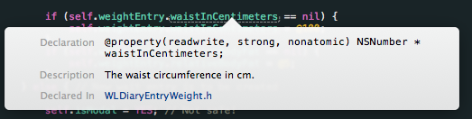
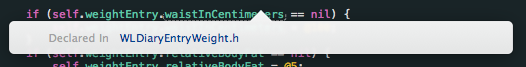

# Welldoo Objective-C Style Guide

This style guide outlines the coding conventions of the iOS team at Welldoo.

## Introduction

This style guide is based on [Cocoa Coding Guidlines](https://developer.apple.com/library/mac/#documentation/Cocoa/Conceptual/CodingGuidelines/CodingGuidelines.html) from Apple. Which means that topics, which are not handled in this guide are sufficiently "regulated" by Appl's documents.

Further more the [Cocoa Fundamentals Guide](https://developer.apple.com/library/mac/#documentation/Cocoa/Conceptual/CocoaFundamentals/Introduction/Introduction.html) describes the basic design concepts, which are to be respected as well. ;)

Further details on iOS development: [iOS App Programming Guide](http://developer.apple.com/library/ios/#documentation/iphone/conceptual/iphoneosprogrammingguide/Introduction/Introduction.html)

## General

Maximum line width is 175. Lines should break where suitable to maintain readability.

## Clang-Format

If you use [_clang-format_](http://clang.llvm.org/docs/ClangFormat.html) to format your code, you should use [_iOS.clang-format_](iOS.clang-format) and put it as _.clang-format_ in your project's or workspace's root folder.

If not done so yet, you may install [_clang-format_](http://clang.llvm.org/docs/ClangFormat.html) via [Homebrew](http://brew.sh):

    brew install clang-format

## Dot-Notation Syntax

Dot-notation should **always** be used for accessing and mutating properties. Bracket notation is to be used for non-property accesses.

**For example:**

    view.backgroundColor = [UIColor orangeColor];
    [UIApplication sharedApplication].delegate;

**Not:**

	[view setBackgroundColor:[UIColor orangeColor]];
	UIApplication.sharedApplication.delegate;

## Curly Brackets / Braces
*Every condition, loop or other block statement must be empraced with curly brackets. Only for single-line-condition statements curly brackets must be omitted.*

**Example**

	if (user.isHappy) {
		// Do something
	} else {
		// Do something else
	}

	NSString *key = user.isHungry ? @"eat" : @"drink";
    
	

## Spacing

* Indent using 4 spaces. Never indent with tabs. Be sure to set this preference in Xcode.
* No egyptian style notation for methods.
* Egyptian style for subsequent scopes (_if_ / _else_ / _switch_ / _while_ / etc.). Always open on the same line as the statement but close on a new line.
* Keywords of related "subblocks" (such as _@catch_ / _else_ / etc.) are put in the same line as the closing brace (or curly bracket) with one space inbetween.
* If methods or initializer has a lot of segments or long segments, they should be aligned by the colon. Every segment in a new line.

**For example:**

	if (user.isHappy) {
		//Do something
	} else {
		//Do something else
	}
	
	@try {
  		foo();
	} @catch (NSException *ex) {
	  bar(ex);
	} @finally {
	  baz();
	}
	
	- (void)initWithEmail:(NSString *)email
	                   cc:(NSArray *)cc
	                   bc:(NSArray *)bc
	              subject:(NSString *)subject
	                 body:(NSString *)body;
	                 

* There should be one or two blank line(s) between methods to aid in visual clarity and organization. Whitespace within methods should separate details further.
* `@synthesize` and `@dynamic` should each be declared on new lines in the implementation.

## Conditionals

Conditional bodies should always use braces even when a conditional body could be written without braces (e.g., it is one line only) to prevent [errors](https://github.com/NYTimes/objective-c-style-guide/issues/26#issuecomment-22074256). These errors include adding a second line and expecting it to be part of the if-statement. Another, [even more dangerous defect](http://programmers.stackexchange.com/a/16530) may happen where the line "inside" the if-statement is commented out, and the next line unwittingly becomes part of the if-statement. In addition, this style is more consistent with all other conditionals, and therefore more easily scannable.

Compare reference (object) values against `nil` with `==`.

**For example:**

	if (!error) {
	    return success;
	}
	NSString *text = ...;
	BOOL *isValid = ...;
	// ...
	if (!isValid || text == nil) {
	    // Do something
	}

**Not:**
	
	if (!error)
	    return success;
	
	or
	
	if (!error) return success;

	NSString *text = ...;
	BOOL *isValid = ...;
	// ...
	if (!isValid || !text) {
	    // Do something
	}

### Ternary Operator

The Ternary operator, ? , should only be used when it increases clarity or code neatness. A single condition is usually all that should be evaluated. Evaluating multiple conditions is usually more understandable as an if statement, or refactored into instance variables.

**For example:**

	result = a > b ? x : y;

**Not:**

	result = a > b ? x = c > d ? c : d : y;

## Error handling

When methods return an error parameter by reference, switch on the returned value, not the error variable, if applicable.

**For example:**

	NSError *error = nil;
	NSArray *result = [self trySomethingWithError:&error];
	if (!result) {
	    // Handle Error
	}

**Not:**

	NSError *error = nil;
	[self trySomethingWithError:&error];
	if (error) {
	    // Handle Error
	}

Some of Apple’s APIs write garbage values to the error parameter (if non-NULL) in successful cases, so switching on the error can cause false negatives (and subsequently crash).

## Methods / Initializer

In method/initializer signatures, there should be a space after the scope (-/+ symbol). There should be a space between the method segments. And, as said before, names schould be chosen according to the Apple guidelines.

The dedicated initializer must be marked (by code comment) as such.

**For Example**:

	- (void)setExampleText:(NSString *)text image:(UIImage *)image;
	- (NSString *)exampleText;

**Not**

	- (void)setExampleText: (NSString*) text image:(UIImage*) image;
	- (NSString*)getExampleText;

**For interfaces or class extensions/categories:**

* First declare properties, then methods
* When declaring methods…
	* First static (class) methods
	* Second initializer(s)
	* Third other methods	

## Variables

Variables should be named as descriptively as possible. Single letter variable names should be avoided except in `for()` loops.

Asterisks indicating pointers belong with the variable, e.g., `NSString *text` not `NSString* text` or `NSString * text`, except in the case of constants.

Property definitions should be used in place of naked instance variables whenever possible. Direct instance variable access should be avoided except in initializer methods (`init`, `initWithCoder:`, etc…), `dealloc` methods and within custom setters and getters. For more information on using Accessor Methods in Initializer Methods and dealloc, see [here](https://developer.apple.com/library/mac/documentation/Cocoa/Conceptual/MemoryMgmt/Articles/mmPractical.html#//apple_ref/doc/uid/TP40004447-SW6).

**For example:**

	@interface NYTSection: NSObject
	
	@property (nonatomic) NSString *headline;
	
	@end

**Not:**

	@interface NYTSection : NSObject {
	    NSString *headline;
	}
	
Initialize object type variables (references) with `nil` if they are not directly initialized with an instance.

**Example**

	NSString *text = nil;
	
	// ... get text
	
	if ([text lenght] > 0) {
	    // Do something
	}

**Not**

	NSString *text; // This might cause a crash when sending messages to 'text' if it hasn't been initilized properly.
	
	// ... get text
	
	if ([text lenght] > 0) {
	    // Do something
	}

#### Variable Qualifiers

When it comes to the variable qualifiers [introduced with ARC](https://developer.apple.com/library/ios/releasenotes/objectivec/rn-transitioningtoarc/Introduction/Introduction.html#//apple_ref/doc/uid/TP40011226-CH1-SW4), the qualifer (`__strong`, `__weak`, `__unsafe_unretained`, `__autoreleasing`) should be placed before the variable type.

**Example**

	__weak NSString *text;
	

## Naming

Apple naming conventions should be adhered to wherever possible, especially those related to [memory management rules](https://developer.apple.com/library/mac/#documentation/Cocoa/Conceptual/MemoryMgmt/Articles/MemoryMgmt.html)

Long, descriptive method and variable names are good.

**For example:**

	UIButton *settingsButton;

**Not**

	UIButton *setBut;

A two or three letter prefix (e.g. `WD`) should always be used for class names and constants, however may be omitted for Core Data entity names. Constants should be camel-case with all words capitalized and prefixed by the related class name for clarity.

**For example:**

	static const NSTimeInterval NYTArticleViewControllerNavigationFadeAnimationDuration = 0.3;

**Not:**

	static const NSTimeInterval fadetime = 1.7;

Properties and local variables should be camel-case with the leading word being lowercase.

Instance variables should be camel-case with the leading word being lowercase, and should be prefixed with an underscore. This is consistent with instance variables synthesized automatically by LLVM. **If LLVM can synthesize the variable automatically, then let it.**
Write abbreviations with first letter uppercase and the rest lower case for method and varibale names. For classes / type names use upper case (e.g. with *NSURL*, *baseURLForService*).

**For example:**

	@synthesize descriptiveVariableName = _descriptiveVariableName;

**Not:**

	id varnm;

## Comments

When they are needed, comments should be used to explain **why** a particular piece of code does something. Any comments that are used must be kept up-to-date or deleted.

Code should be as self-documenting as possible, with only the need for intermittent, few-line explanations. This does not apply to those comments used to generate documentation.

Comments on methods and properties must be block comments (_/\* \*/_). Put at least an empty block comment (_/\* \*/_) on each property and method declaration (independently if they are declared in the interface (.h) or implementation (.m) block.
This results in comprehensive popup information displayed in XCode when doing an alt+click on a method or variable reference.

***Good***

***Bad***

## init and dealloc

*Use ARC!*
Put initializer methods above all methods.

## Literals

`NSString`, `NSDictionary`, `NSArray`, and `NSNumber` literals should be used whenever creating immutable instances of those objects. Pay special care that `nil` values not be passed into `NSArray` and `NSDictionary` literals, as this will cause a crash.

**For example:**

	NSArray *names = @[@"Brian", @"Matt", @"Chris", @"Alex", @"Steve", @"Paul"];
	NSDictionary *productManagers = @{@"iPhone" : @"Kate", @"iPad" : @"Kamal", @"Mobile Web" : @"Bill"};
	NSNumber *shouldUseLiterals = @YES;
	NSNumber *buildingZIPCode = @10018;

**Not:**

	NSArray *names = [NSArray arrayWithObjects:@"Brian", @"Matt", @"Chris", @"Alex", @"Steve", @"Paul", nil];
	NSDictionary *productManagers = [NSDictionary dictionaryWithObjectsAndKeys: @"Kate", @"iPhone", @"Kamal", @"iPad", @"Bill", @"Mobile Web", nil];
	NSNumber *shouldUseLiterals = [NSNumber numberWithBool:YES];
	NSNumber *buildingZIPCode = [NSNumber numberWithInteger:10018];

## CGRect Functions

When accessing the `x`, `y`, `width`, or `height` of a `CGRect`, always use the [`CGGeometry` functions](http://developer.apple.com/library/ios/#documentation/graphicsimaging/reference/CGGeometry/Reference/reference.html) instead of direct struct member access. From Apple's `CGGeometry` reference:

> All functions described in this reference that take CGRect data structures as inputs implicitly standardize those rectangles before calculating their results. For this reason, your applications should avoid directly reading and writing the data stored in the CGRect data structure. Instead, use the functions described here to manipulate rectangles and to retrieve their characteristics.

**For example:**

	CGRect frame = self.view.frame;
	
	CGFloat x = CGRectGetMinX(frame);
	CGFloat y = CGRectGetMinY(frame);
	CGFloat width = CGRectGetWidth(frame);
	CGFloat height = CGRectGetHeight(frame);

**Not:**

	CGRect frame = self.view.frame;
	
	CGFloat x = frame.origin.x;
	CGFloat y = frame.origin.y;
	CGFloat width = frame.size.width;
	CGFloat height = frame.size.height;

## Constants

Constants are preferred over in-line string literals or numbers, as they allow for easy reproduction of commonly used variables and can be quickly changed without the need for find and replace. Constants should be declared as `static` constants and not `#define`s unless explicitly being used as a macro.

**For example:**

	/* */
	static NSString * const WDDefaultCategory = @"My Category";
	/* */
	static const CGFloat NYTImageThumbnailHeight = 50.0;

**Not:**

	#define DefaultCategory @"My Category"

	#define thumbnailHeight 2

Further prefix keys (e.g. for use in `NSDictionary`s) with `k` and suffix notification names (for use with `NSNotificationCenter`) with `Notification`

**For example:**

	/* */
	static NSString * const kWDNewMessagesAvailableNotification = @"kWDNewMessagesAvailableNotification";
	/* */
	static NSString * const kWDUserNameKey = @"kWDUserNameKey";

**Not:**

	/* */
	static NSString * const WDNewMessagesAvailable = @"WDNewMessagesAvailable";
	/* */
	static NSString * const WDUserNameKey = @"WDUserNameKey";

## Enumerated Types

When using `enum`s, it is recommended to use the new fixed underlying type specification because it has stronger type checking and code completion. The SDK now includes a macro to facilitate and encourage use of fixed underlying types — `NS_ENUM()`

**Example:**

	typedef NS_ENUM(NSInteger, NYTAdRequestState) {
	    NYTAdRequestStateInactive,
	    NYTAdRequestStateLoading
	};

## Bitmasks

When working with bitmasks, use the `NS_OPTIONS` macro.

**Example:**

	typedef NS_OPTIONS(NSUInteger, NYTAdCategory) {
	  NYTAdCategoryAutos      = 1 << 0,
	  NYTAdCategoryJobs       = 1 << 1,
	  NYTAdCategoryRealState  = 1 << 2,
	  NYTAdCategoryTechnology = 1 << 3
	};

## Private Properties

Private properties should be declared in class extensions (anonymous categories) in the implementation file of a class. Named categories (such as `NYTPrivate` or `private`) should never be used unless extending another class.

**For example:**

	@interface NYTAdvertisement ()
	
		@property (nonatomic, strong) GADBannerView *googleAdView;
		@property (nonatomic, strong) ADBannerView *iAdView;
		@property (nonatomic, strong) UIWebView *adXWebView;
	
	@end

## Image Naming

Image names should be named consistently to preserve organization and developer sanity. They should be named as one camel case string with a description of their purpose, followed by the un-prefixed name of the class or property they are customizing (if there is one), followed by a further description of color and/or placement, and finally their state.

**For example:**

* `RefreshBarButtonItem` / `RefreshBarButtonItem@2x` and `RefreshBarButtonItemSelected` / `RefreshBarButtonItemSelected@2x`
* `ArticleNavigationBarWhite` / `ArticleNavigationBarWhite@2x` and `ArticleNavigationBarBlackSelected` / `ArticleNavigationBarBlackSelected@2x`.

Images that are used for a similar purpose should be grouped in respective groups in an Images folder.

## Booleans

Never compare something directly to `YES`, because `YES` is defined to 1 and a `BOOL` can be up to 8 bits.

**For a `BOOL`, here are two examples:**

	if (isAwesome)
	if (![someObject boolValue])

**Not:**

	if (isAwesome == YES) // Never do this.
	if ([someObject boolValue] == NO)

Boolean properties must not omit the “is” prefix.

**Example**

	@property (nonatomic) BOOL isEditable;

Text and example taken from the [Cocoa Naming Guidelines](https://developer.apple.com/library/mac/#documentation/Cocoa/Conceptual/CodingGuidelines/Articles/NamingIvarsAndTypes.html#//apple_ref/doc/uid/20001284-BAJGIIJE).

## Singletons

Singleton objects should use a thread-safe pattern for creating their shared instance.

	/** */
	static WDUserManager *instance = nil;
	/** */
	static bool isFirstAccess = YES;

	+ (instancetype)sharedManager
	{
	    static dispatch_once_t onceToken;
	    dispatch_once(&onceToken, ^{
	        isFirstAccess = NO;
	        instance = [[super allocWithZone:NULL] init];    
	    });
	    
	    return instance;
	}
	
	
	#pragma mark - Life Cycle
	
	+ (instancetype)allocWithZone:(NSZone *)zone
	{
	    return [self sharedManager];
	}
	
	+ (instancetype)copyWithZone:(struct _NSZone *)zone
	{
	    return [self sharedManager];
	}
	
	+ (instancetype)mutableCopyWithZone:(struct _NSZone *)zone
	{
	    return [self sharedManager];
	}
	
	- (instancetype)copy
	{
	    return [[FAStreamManager alloc] init];
	}
	
	- (instancetype)mutableCopy
	{
	    return [[FAStreamManager alloc] init];
	}
	
	- (instancetype) init
	{
	    if (instance) {
	        return instance;
	    }
	    if (isFirstAccess) {
	        [self doesNotRecognizeSelector:_cmd];
	    }
	    
	    self = [super init];
	    if (self) {
	        // Further initialization if necessary
	    }
	    return self;
	}

## Xcode project

The physical files should be kept in sync with the Xcode project files in order to avoid file sprawl. Any Xcode groups created should be reflected by folders in the filesystem. Code should be grouped not only by type, but also by feature for greater clarity.

 
